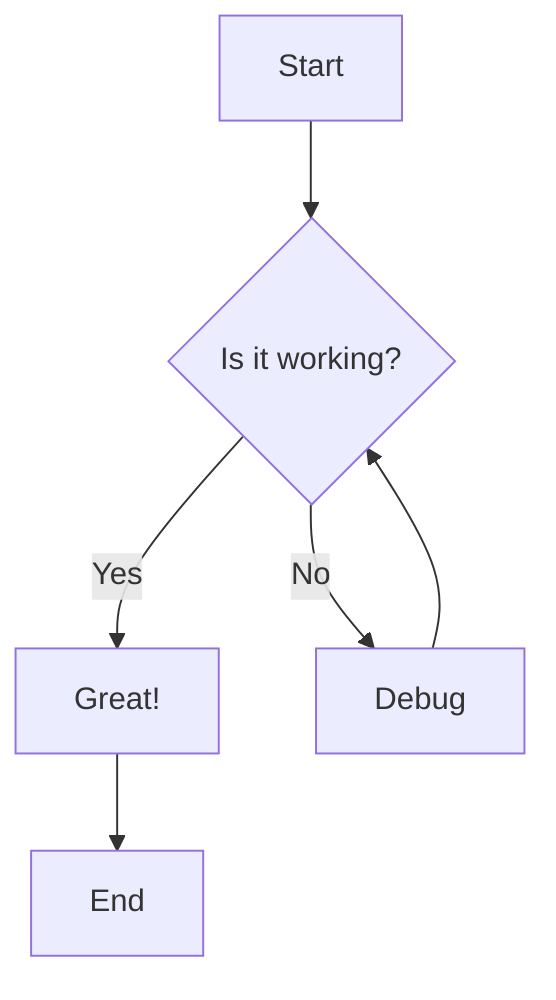

# Sample Passage

## Introduction

This is a **sample passage** to demonstrate all the markdown features supported by the renderer.

## Text Formatting

You can use **bold text**, *italic text*, ~~strikethrough~~, and ***bold italic*** text. You can also use `inline code` within paragraphs. Here's a [link to GitHub](https://github.com).

## Lists

### Unordered Lists

- Item one
- Item two
  - Nested item A
  - Nested item B
- Item three

### Ordered Lists

1. First step
2. Second step
   1. Sub-step a
   2. Sub-step b
3. Third step

### Task Lists

- [x] Completed task
- [x] Another completed item
- [ ] Pending task
- [ ] Yet to do

## Blockquotes

> This is a blockquote. It can span multiple lines.
>
> And have multiple paragraphs.
>
> > Nested blockquotes are also supported.

## Code Blocks

```typescript
interface User {
  id: number;
  name: string;
  email: string;
}

function greet(user: User): string {
  return `Hello, ${user.name}! Welcome back.`;
}

const result = greet({ id: 1, name: "Alice", email: "alice@example.com" });
console.log(result);
```

```python
def fibonacci(n: int) -> list[int]:
    seq = [0, 1]
    for _ in range(n - 2):
        seq.append(seq[-1] + seq[-2])
    return seq[:n]

print(fibonacci(10))
```

```bash
#!/bin/bash
echo "Hello, World!"
for file in *.md; do
  echo "Processing $file"
done
```

## Tables

| Feature | Support | Description |
|---------|---------|-------------|
| Tables | Yes | Tables with alignment |
| Code | Yes | Syntax highlighted code blocks |
| Math | Yes | LaTeX math expressions |
| Emoji | Yes | Emoji shortcodes :smile: |

| Left-aligned | Center-aligned | Right-aligned |
|:-------------|:--------------:|--------------:|
| Content | Content | Content |
| Row 2 | Row 2 | Row 2 |

## Math

Inline math: $E = mc^2$

Block math:

$$
\frac{d}{dx}\left( \int_{a}^{x} f(t)\,dt \right) = f(x)
$$

The quadratic formula:

$$
x = \frac{-b \pm \sqrt{b^2 - 4ac}}{2a}
$$

## Emoji

:smile: :heart: :rocket: :books: :coffee: :cat: :sparkles:

## Horizontal Rule

Above the rule...

---

Below the rule.

## Images


## HTML Elements (Raw HTML)

<div style="text-align: center; padding: 1rem; background: rgba(136, 57, 239, 0.08); border-radius: 8px; margin: 1rem 0;">
  <strong>Custom HTML block</strong> rendered via rehype-raw.
</div>

<details>
<summary>Click to expand details</summary>

This content is hidden by default and can be expanded.

- You can put any markdown here
- Including code and other elements

</details>

## Footnotes

Here's a sentence with a footnote reference[^1].

And another one with a longer footnote[^2].

[^1]: This is the first footnote content.
[^2]: This is the second footnote with more detailed explanation. It can contain multiple paragraphs and even code.

## Definition Lists

Term 1
: Definition for term 1

Term 2
: Definition for term 2
: Another definition for term 2

## Subscript and Superscript

H~2~O is water. E = mc^2^ is famous. 29^th^ anniversary.

## Abbreviations

The HTML specification is maintained by the W3C.

*[HTML]: HyperText Markup Language
*[W3C]: World Wide Web Consortium

## Mermaid Diagram



## End

That's the end of the sample. Thank you for reading! :wave:
